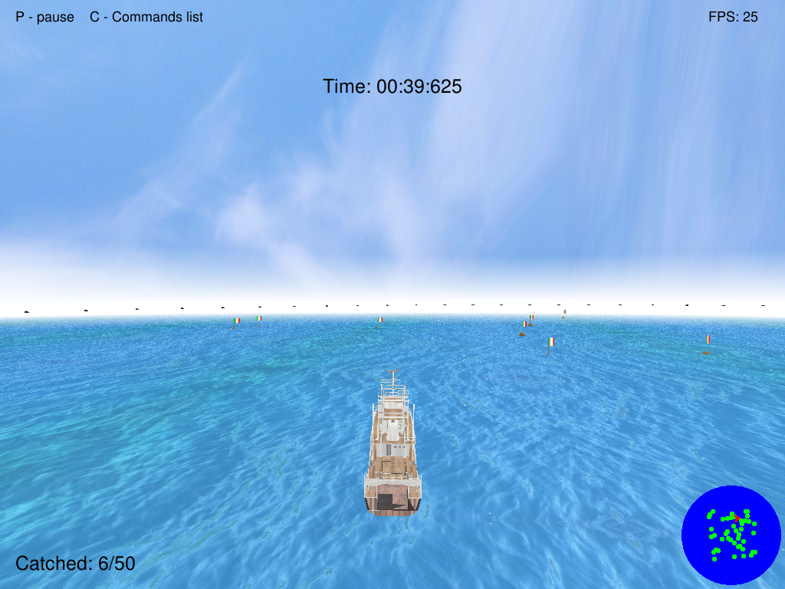

# Open Sailing
*Autore: Lorenzo Vainigli*

*Corso di Grafica a.a. 2017/18, Laurea Magistrale in Informatica*

*Università di Bologna*

Open Sailing è un piccolo gioco realizzato con le librerie SDL2 e OpenGL. L'utente si trova al comando di
un'imbarcazione nel mezzo al mare ed è circondato da numerose boe a cui sono fissate delle bandiere. Il suo obiettivo è
raccogliere tutte le boe nel minor tempo possibile.

